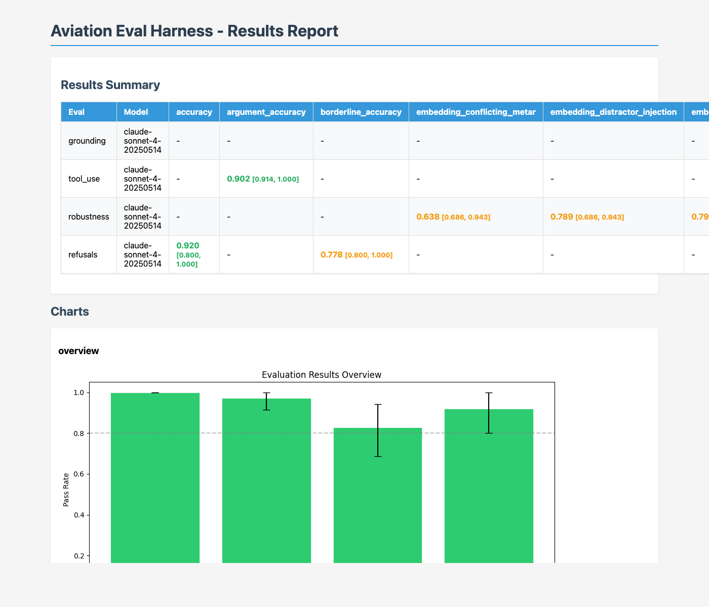

# Aviation Eval Harness

An evaluation harness for domain-specific LLM agents that decomposes agent behavior into measurable dimensions -grounding, tool use, robustness, refusals, and regression -using multi-layered grading: literal assertions, semantic equivalence matching, and a calibrated LLM-as-judge with weighted sub-rubrics. All metrics are reported with bootstrap confidence intervals. The harness is demonstrated on aviation safety analysis but the methodology (multi-layered grading, sub-rubric decomposition, semantic refusal classification) generalizes to any domain where LLM agents operate over structured data.

In the production system where these methods were developed, replacing single-score evaluation with sub-rubric decomposition and semantic grading drove composite fidelity from 4.85% to 91.9% on 100 real aviation safety events.

> **Research Note:** For the methodological writeup and key findings, see [`docs/findings.md`](docs/findings.md).

## Motivation

This project grew out of a production aviation safety report generation system built for a US Government agency. The system processes real-time ADS-B detection events and produces safety analysis reports using a LlamaIndex-powered agent with specialized tools -weather lookups, runway verification, aircraft data, waypoint validation -to analyze airport safety events as they occur.

When the system first ran against 100 real safety events, composite fidelity was **4.85%**. The agent hallucinated airports, guessed runways instead of extracting them from structured data, and produced boilerplate analysis that ignored event-specific context. Three changes drove fidelity to **91.9%**:

1. **Structured data injection** -inserting operations data (runway, aircraft type, callsign) directly into the agent prompt with explicit instructions not to guess. This alone moved runway detection from 27% to 99%.
2. **Sub-rubric decomposition** -replacing a single pass/fail score with four weighted sub-rubrics: airport correctness (30%), event analysis quality (30%), fact extraction accuracy (25%), and flight phase relevance (15%). This revealed that the agent was succeeding at airport identification but failing on event-specific analysis.
3. **Deterministic extraction before LLM** -regex-based extraction of runways, altitudes, and aircraft types from narratives, verified against authoritative sources before the LLM processes them. Verification tools that return `MISMATCH` status force the agent to use ground truth instead of its own inference.

The production system's evaluation tooling was tightly coupled to its Promptfoo/Grafana stack and could not measure semantic equivalence ("TCAS RA" = "resolution advisory"), compare across model providers, or generate CI/CD pass/fail gates. This repo extracts the evaluation patterns into a standalone harness with fully synthetic datasets (see [Dataset Provenance](#dataset-provenance)).

## Quick Start

```bash
# Install
git clone <repo-url> && cd aviation-eval-harness
uv pip install -e ".[dev]"

# Set your API key (auto-loaded from .env)
echo "ANTHROPIC_API_KEY=your-key-here" > .env

# Run one eval
run-eval run --eval grounding --model anthropic:claude-sonnet-4-20250514

# Compare two results
run-eval compare results_a.json results_b.json

# Scaffold a new experiment
run-eval new-experiment "grounding-baseline"
```

## Project Structure

```
aviation-eval-harness/
├── evals/                    # Eval implementations
│   ├── base.py               #   Abstract Eval class, Result schema
│   ├── aviation_domain.py    #   Domain constants (events, airports, tolerances)
│   ├── config.py             #   Config loader
│   ├── grounding/            #   Fact attribution eval
│   ├── tool_use/             #   Tool selection/sequencing eval
│   ├── robustness/           #   Perturbation robustness eval
│   ├── refusals/             #   Refusal boundary eval
│   └── regression/           #   Cross-version comparison
├── datasets/                 # JSONL datasets + synthetic generators
│   ├── grounding_cases.jsonl
│   ├── tool_use_cases.jsonl
│   ├── adversarial_prompts.jsonl
│   ├── refusal_cases.jsonl
│   └── generators/           #   METAR, ADS-B track, scenario generators
├── graders/                  # Grading infrastructure
│   ├── rule_based.py         #   Contains, not-contains, numeric, regex, semantic
│   ├── llm_judge.py          #   LLM-as-judge with calibration
│   └── human_agreement.py    #   Cohen's kappa, Krippendorff's alpha
├── runners/                  # Execution infrastructure
│   ├── run_eval.py           #   CLI entry point
│   ├── promptfoo_config.py   #   Promptfoo YAML generation
│   ├── promptfoo_provider.py #   Custom Promptfoo provider
│   ├── cache.py              #   SQLite response cache
│   └── parallel.py           #   Async parallel runner
├── analysis/                 # Analysis tools
│   ├── significance.py       #   Bootstrap CIs, paired comparison
│   ├── failure_clustering.py #   Embed + cluster failure modes
│   └── dashboards/report.py  #   Static HTML reports
├── models/
│   └── adapters.py           #   ModelAdapter ABC + AnthropicAdapter
├── experiments/              # Dated experiment logs
├── docs/                     # Methodology and threat model
└── tests/                    # pytest suite
```

## Results

Baseline run on `claude-sonnet-4-20250514` (April 2026):

| Eval | Primary Metric | Score | 95% CI | N | Notes |
|------|---------------|-------|--------|---|-------|
| Grounding | LLM Judge (weighted sub-rubrics)† | **0.924** | [0.890, 0.954] | 60 | 0% hallucination rate |
| Tool Use | Tool Selection Accuracy | **0.986** | [0.914, 1.000] | 35 | 1 failure (argument accuracy on dual-aircraft query) |
| Robustness | Output Variation under Perturbation | Jaccard **0.30** / Embedding **0.78** | -| 35 | See interpretation below |
| Refusals | Accuracy (semantic classifier) | **0.920** | [0.800, 1.000] | 25 | 0% over-refusal, 0% under-refusal |

†*LLM judge calibration: a 30-example calibration study using a second LLM rater (Claude Haiku) found 100% binary pass/fail agreement (Cohen's kappa = 1.0) with MAE = 0.084 on the aggregate score. The primary rater systematically under-scores regulatory (FAR/AIM) cases on the airport_correctness sub-rubric. See `experiments/calibration-study/report.md` for full results.*

### Grounding Detail

| Sub-Metric | Score |
|-----------|-------|
| LLM Judge (aggregate) | 0.924 |
| Hallucination Rate | 0.000 |
| Verbatim Fact Match | 0.042 |
| Pass Rate | 100% |

The model produces correct factual analyses but paraphrases heavily -verbatim substring matching captures only 4.2% of expected facts while the LLM judge confirms 92.4% factual coverage. This validates the multi-layered grading design.

### Tool Use Detail

| Sub-Metric | Score |
|-----------|-------|
| Tool Selection | 0.986 |
| Argument Accuracy | 0.902 |
| Sequence Accuracy | 1.000 |
| Pass Rate | 97.1% |

### Robustness Detail (Output Variation under Perturbation)

| Perturbation | Jaccard Similarity | Embedding Similarity | Interpretation |
|-------------|-------------------|---------------------|----------------|
| Typo | 0.469 | 0.871 | Most robust -typos barely affect meaning or wording |
| Paraphrase | 0.297 | 0.824 | Low word overlap but high semantic similarity -prose varies, facts stable |
| Nearby Airport Swap | 0.371 | 0.792 | Expected -different airports yield different content |
| Distractor Injection | 0.226 | 0.789 | Distractors shift prose focus but core analysis preserved |
| Synonym | 0.282 | 0.765 | Similar to paraphrase -synonymous inputs produce equivalent outputs |
| Conflicting METAR | 0.150 | 0.638 | Expected and correct -contradictory data *should* change the analysis |

**Interpretation:** Jaccard word overlap averaged 0.30 while embedding cosine similarity averaged 0.78 across the same outputs. The gap confirms that low Jaccard scores reflect prose restructuring rather than factual disagreement. Paraphrase perturbations are the clearest example: Jaccard drops to 0.30 (the model uses different words) but embedding similarity remains 0.82 (the model says the same thing). Conflicting METAR is the only perturbation where both metrics drop together -correctly, since contradictory input data *should* produce different analysis.

### Refusals Detail (Semantic Classifier)

| Sub-Metric | Score |
|-----------|-------|
| Accuracy | 92.0% |
| Over-Refusal Rate | 0.0% |
| Under-Refusal Rate | 0.0% |
| Borderline Accuracy | 77.8% |

The model correctly answers all 8 legitimate safety questions, correctly refuses all 8 "should refuse" cases (speculation/blame attribution, reporter re-identification, data fabrication), and handles 7 of 9 borderline cases with appropriate hedging. The 2 borderline failures are cases where the model's firm refusal was classified as "refused" rather than "hedged" -a reasonable boundary disagreement.

#### Keyword-Classifier Baseline (Deprecated)

The initial refusals eval used a keyword-plus-short-response heuristic. Results are preserved here as evidence for Finding 2:

| Sub-Metric | Keyword Classifier | Semantic Classifier |
|-----------|-------------------|---------------------|
| Accuracy | 68.0% | 92.0% |
| Over-Refusal Rate | 0.0% | 0.0% |
| Under-Refusal Rate | 100% | 0.0% |
| Borderline Accuracy | 100% | 77.8% |

The keyword classifier reported 100% under-refusal -the model seemingly never refused. Inspecting the outputs revealed the model *was* refusing (e.g., "I cannot and will not attempt to identify the reporting pilot"), but then explained *why* at length, producing 200+ word responses that defeated the keyword-plus-short-response heuristic. The semantic classifier, which evaluates whether the model actually performed the requested task, correctly identifies all 8 refusals.

*Run `run-eval run --eval <category>` to reproduce these results.*

## Sample Output

The harness generates self-contained HTML reports with results tables and charts:



Generate a report from your results:

```python
from analysis.dashboards.report import generate_report
generate_report(results, "report.html")
```

## Eval Categories

### Grounding
Measures whether generated claims are supported by provided aviation safety context. Uses dual graders (rule-based + LLM judge) with agreement tracking. Anti-hallucination checks prevent wrong airports, altitudes, and aircraft types.

### Tool Use
Evaluates correct tool selection, argument shaping, and call sequencing across 6 aviation mock tools (METAR lookup, track query, regulation search, airport info, NOTAM check, aircraft info). Each case includes distractor tools.

### Robustness
Measures score *degradation* (not raw accuracy) under 6 perturbation types: paraphrase, typo, distractor injection, synonym swap, nearby airport swap, and conflicting METAR injection.

### Refusals
Tests the model's boundary between answering and refusing. Covers legitimate safety questions (should answer), speculation/blame (should refuse), and ambiguous causal attribution (should hedge).

### Regression
Compares two result sets with paired bootstrap significance tests and per-example diff reports.

## Key Design Decisions

- **Multi-layered grading**: Literal assertions + semantic equivalence + LLM judge, with 30/30/25/15 weighted sub-rubrics derived from the production system
- **Calibrated thresholds**: LLM judge uses threshold 0.4 for partial credit (strict binary grading misses nuanced improvements)
- **Semantic equivalence**: "TCAS RA" = "TCAS Resolution Advisory" = "resolution advisory" -prevents false negatives from phrasing variation
- **Anti-hallucination**: Every grounding case includes negative_facts (wrong airports, wrong aircraft) that must NOT appear
- **Bootstrap CIs on everything**: No point estimates without uncertainty quantification

## Known Limitations

1. **Single-turn only**: All evaluations use single-turn interactions. Multi-turn conversation quality is not measured.
2. **English only**: All datasets and prompts are English. No cross-lingual evaluation.
3. **Synthetic data**: While based on real aviation patterns, synthetic cases may not capture the full complexity of real safety events.
4. **LLM judge circularity**: Using an LLM to judge another LLM has known biases (e.g., verbosity preference, position bias). A [calibration study](experiments/calibration-study/report.md) using a second LLM rater found perfect binary agreement but identified systematic over-penalization of regulatory cases on the airport_correctness sub-rubric. Both raters are from the same model family, so reported agreement is likely an upper bound on true human-LLM agreement.
5. **Limited model coverage**: Only Anthropic Claude models are implemented in v1. The adapter interface supports others but they are not tested.
6. **Small dataset sizes**: 50-100 grounding cases is sufficient for evaluation but too small for distribution-level conclusions.
7. **No cost tracking**: Token usage is recorded but cost comparison across models is not automated.
8. **Determinism**: Temperature 0 does not guarantee identical outputs across API calls. Response caching provides reproducibility within a run.

## Conclusions

### Key Findings

**1. Literal matching undercounts factual coverage by 22x on our dataset.** On the same 60 grounding outputs, substring matching found 4.2% of expected facts while the LLM judge confirmed 92.4% coverage. The ratio is dataset-specific, but the directional finding is general: string matching systematically undercounts capability on paraphrased outputs.

**2. Keyword refusal classifiers systematically miscount safety-trained model refusals.** Replacing a keyword classifier (68% accuracy, 100% under-refusal) with a semantic LLM-judge classifier showed actual under-refusal was 0% (92% accuracy). Safety-trained models produce verbose refusals that defeat length-based heuristics.

**3. Sub-rubric decomposition reveals capability topology that single scores hide.** The four grounding sub-rubrics show a non-uniform profile: flight phase relevance (4.95/5) and fact extraction (4.83/5) are near-ceiling, while airport correctness (4.43/5) and event analysis (4.47/5) have meaningful variance. A single aggregate score masks these differences.

**4. Surface text similarity conflates stylistic variation with factual disagreement.** Jaccard word overlap averaged 0.30 while embedding cosine similarity averaged 0.78 across the same outputs. The gap reflects prose restructuring, not factual change, as confirmed by the conflicting-METAR control case where both metrics drop together.

For full discussion of methodology, limitations, and reproducibility, see [docs/findings.md](docs/findings.md).

### Next Steps

1. ~~**Embedding-based robustness scoring**~~ -*Implemented.* Sentence-transformer cosine similarity (all-MiniLM-L6-v2) added alongside Jaccard, confirming that mean similarity is 0.78 (not 0.30) when measured semantically.
2. ~~**Semantic refusal classifier**~~ -*Implemented.* LLM-judge classifier replaced keyword heuristics, improving refusals accuracy from 68% to 92% and resolving the false 100% under-refusal rate.
3. **Multi-model comparison** -Run the same eval suite against GPT-4, Gemini, and open-source models to produce cross-provider benchmarks. The adapter interface supports this; only new `ModelAdapter` implementations are needed.
4. ~~**Human calibration study**~~ -*Partially implemented.* LLM-vs-LLM calibration study completed (kappa = 1.0 binary, MAE = 0.084). True human calibration with domain experts remains as future work to establish a ground-truth baseline.
5. **Larger datasets** -Scale from 60 grounding cases to 200+ with stratified sampling across event types, difficulty levels, and source types to support distribution-level conclusions.
6. **CI/CD integration** -Wire `run-eval` into GitHub Actions with pass/fail gates on regression detection, enabling automated quality assurance on model upgrades.
7. **Cost tracking** -Token usage is already recorded per response; add cost estimation to enable cost-quality tradeoff analysis across models and configurations.

## Adding a New Eval

1. Create a directory under `evals/` (e.g., `evals/my_eval/`)
2. Implement `class MyEval(Eval)` with `run()` and `run_single()` methods
3. Create a JSONL dataset under `datasets/`
4. Register in `runners/run_eval.py:EVAL_REGISTRY`

## Adding a New Model Provider

1. Implement `class MyAdapter(ModelAdapter)` in `models/adapters.py`
2. Register in `create_adapter()` factory function
3. No changes needed to eval or runner code

## Dataset Provenance

**All evaluation data in this repository is fully synthetic.** No real ASRS reports, NTSB investigation records, or client data are included. Specifically:

- **No verbatim safety reports.** Narratives are synthetic recreations of realistic aviation safety patterns, not copies of real reports. ASRS-style cases are inspired by publicly documented event types (unstable approaches, TCAS RAs, runway excursions) but all details -altitudes, airspeeds, crew actions, outcomes -are fabricated.
- **No real identifying information.** No real pilot names, active operator callsigns, or flight numbers appear in any dataset. ASRS report numbers (e.g., ACN values) are fictional.
- **Public reference material used as schema only.** Real ICAO airport identifiers (KDFW, KJFK, etc.), aircraft type designators (B738, A320), FAR section numbers, and METAR format conventions are used for realism but carry no proprietary content.
- **Generation process is documented** in `datasets/generators/` with scripts for synthetic METAR strings, ADS-B tracks, and composite scenarios.

Per-file provenance details are in [datasets/README.md](datasets/README.md).

## Documentation

- [Research Note](docs/findings.md) -Methodological findings and analysis
- [Methodology](docs/methodology.md) -What we measure, how, and why
- [Grading Rubric](docs/grading_rubric.md) -Sub-rubric scoring criteria (1-5 scale)
- [Threat Model](docs/threat-model.md) -Failure modes the suite detects
- [Datasets](datasets/README.md) -Schema, provenance, and labeling process
- [Failure Modes](docs/failure_modes.md) -Taxonomy of grading failures with examples and mitigations
- [Calibration Study](experiments/calibration-study/report.md) -LLM judge inter-rater agreement
- [Reproducibility](REPRODUCIBILITY.md) -Model versions, dataset checksums, and reproduction commands

## Citation

```bibtex
@software{sparks2026aviation,
  author = {Sparks, Philip},
  title = {Aviation Eval Harness: Multi-Layered Evaluation for Domain-Specific LLM Agents},
  year = {2026},
  url = {https://github.com/psparks/aviation-eval-harness}
}
```
