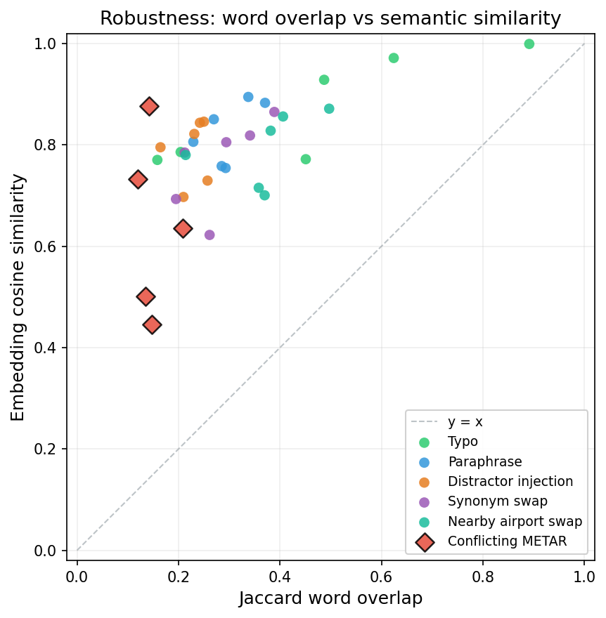

# Multi-Layered Evaluation for Domain-Specific LLM Agents: Findings from Aviation Safety Analysis

## Abstract

We describe an evaluation harness for domain-specific LLM agents, developed in the context of aviation safety report generation. The harness decomposes agent behavior into four measurable dimensions -grounding, tool use, robustness, and refusals -using multi-layered grading that combines literal assertions, semantic equivalence matching, and calibrated LLM-as-judge scoring with weighted sub-rubrics. We report three methodological findings: (1) literal substring matching captures only 4% of facts that an LLM judge confirms are present in the same outputs (a 22x undercount on our 60-case grounding dataset), (2) keyword-based refusal classifiers systematically miscount refusals from safety-trained models, which produce verbose refusals that defeat short-response heuristics, and (3) surface-level text similarity metrics on long-form outputs conflate stylistic variation with factual disagreement, as demonstrated by a 2.6x gap between Jaccard word overlap (0.30) and embedding cosine similarity (0.78). All evaluation data is synthetic and all results are reported with bootstrap confidence intervals. A calibration study comparing two LLM raters found perfect binary pass/fail agreement (Cohen's kappa = 1.0) with systematic disagreement on sub-rubric scoring for regulatory questions.

## Motivation

This work originated in a production aviation safety system built for a US Government agency. The system processes real-time ADS-B detection events and generates safety analysis reports using an LLM-powered agent with specialized tools for weather lookups, runway verification, aircraft data, and waypoint validation.

When the system first ran against 100 real safety events, composite fidelity was 4.85%. The agent hallucinated airports, guessed runways instead of extracting them from structured data, and produced boilerplate analysis that ignored event-specific context. Three changes drove fidelity to 91.9%: (1) injecting structured operations data directly into the agent prompt, (2) replacing a single pass/fail score with four weighted sub-rubrics, and (3) deterministic extraction of verifiable facts before LLM processing.

The production system's evaluation tooling was tightly coupled to its Promptfoo/Grafana infrastructure and could not easily measure semantic equivalence, compare across model providers, or generate pass/fail gates for CI/CD. We extracted the evaluation patterns into this standalone harness to address these limitations and to study the methodological questions that arose during development.

## Method

### Evaluation dimensions

The harness decomposes LLM agent behavior into four evaluation categories, each targeting a distinct failure mode:

- **Grounding** (N=60): whether generated claims are supported by provided context. Uses multi-layered grading: literal substring matching, semantic equivalence mapping (e.g., "TCAS RA" = "resolution advisory"), and an LLM judge with four weighted sub-rubrics (airport correctness 30%, event analysis quality 30%, fact extraction accuracy 25%, flight phase relevance 15%). Anti-hallucination checks verify that plausible but incorrect facts (wrong airports, wrong aircraft) do not appear.

- **Tool use** (N=35): correct tool selection, argument shaping, and call sequencing across six mock aviation tools. Each case includes distractor tools to test selectivity.

- **Robustness** (N=35): output stability under six perturbation types (paraphrase, typo, distractor injection, synonym swap, nearby airport swap, conflicting METAR). Measured using both Jaccard word overlap and sentence-transformer embedding cosine similarity (all-MiniLM-L6-v2).

- **Refusals** (N=25): correct boundary between answering legitimate questions, refusing inappropriate requests (ASRS reporter re-identification, blame attribution, safety data fabrication), and hedging on ambiguous queries. Classified using an LLM-judge semantic classifier.

### Grading architecture

Grading uses three layers, applied in sequence:

1. **Rule-based assertions**: `ContainsGrader` checks for expected facts via substring matching. `NotContainsGrader` checks that negative facts (plausible hallucinations) are absent. `SemanticEquivalenceGrader` maps domain-specific synonyms.

2. **LLM judge**: scores outputs on a 1-5 scale per sub-rubric using a structured prompt. Sub-rubric scores are combined with weights derived from the production system (30/30/25/15). A threshold of 0.4 (normalized) is used for partial credit.

3. **Agreement tracking**: rule-based and LLM judge results are compared per-example to identify cases where they disagree, enabling calibration.

### Statistical approach

All aggregate metrics are reported with 95% bootstrap confidence intervals (10,000 iterations, seed 42). Cross-version comparisons use paired bootstrap tests with significance threshold p < 0.05.

### Calibration

A 30-example calibration study compared the primary LLM judge (Claude Sonnet) against a second LLM rater (Claude Haiku) using the grading rubric defined in `docs/grading_rubric.md`. Both raters scored the same model outputs independently. This is an LLM-vs-LLM calibration, not a human-vs-LLM study; reported agreement is likely an upper bound on true human-LLM reliability.

### Datasets

All evaluation data is fully synthetic. Narratives are original compositions modeled on the structure of public ASRS reports, NTSB probable-cause summaries, and FAR regulatory text. No verbatim safety reports, real pilot names, or active operator callsigns are included. Per-file provenance is documented in `datasets/README.md`.

## Results

Baseline evaluation on `claude-sonnet-4-20250514` (April 2026):

| Eval | Primary Metric | Score | 95% CI | N |
|------|---------------|-------|--------|---|
| Grounding | LLM Judge (weighted sub-rubrics) | 0.924 | [0.890, 0.954] | 60 |
| Tool Use | Tool Selection Accuracy | 0.986 | [0.914, 1.000] | 35 |
| Robustness | Embedding Cosine Similarity | 0.784 | -| 35 |
| Refusals | Accuracy (semantic classifier) | 0.920 | [0.800, 1.000] | 25 |

**Grounding**: the model achieved 92.4% factual coverage with zero hallucinations across 60 cases. Sub-rubric decomposition revealed a non-uniform capability profile: flight phase relevance (4.95/5) and fact extraction accuracy (4.83/5) were near-ceiling, while airport correctness (4.43/5) and event analysis quality (4.47/5) showed meaningful variance.

**Tool use**: 98.6% tool selection accuracy, 100% sequence accuracy, 90.2% argument accuracy. The single failure occurred on a dual-aircraft track query requiring multiple argument sets.

**Robustness**: mean Jaccard similarity of 0.30 and mean embedding similarity of 0.78 across six perturbation types. Per-type breakdown showed typo perturbations as most robust (Jaccard 0.47, embedding 0.87) and conflicting METAR as least robust (Jaccard 0.15, embedding 0.64).

**Refusals**: 92% accuracy with 0% over-refusal and 0% under-refusal. All 8 "should refuse" cases were correctly refused. Two borderline cases were classified as "refused" rather than "hedged," a reasonable boundary disagreement.

**Calibration**: binary pass/fail agreement between primary and second rater was 100% (Cohen's kappa = 1.0). Mean absolute error on the aggregate score was 0.084. The primary rater scored systematically lower on airport_correctness (4.43 vs 4.83) and event_analysis_quality (4.47 vs 4.93), particularly on regulatory (FAR/AIM) cases where the airport_correctness sub-rubric is arguably inapplicable.

## Finding 1: Literal substring matching undercounts factual coverage by 22x

The 22x ratio is specific to this dataset and model; the directional finding (substring matching systematically undercounts) is likely general.

On our 60-case grounding dataset, exact substring matching found 4.2% of expected facts while the LLM judge confirmed 92.4% factual coverage. The model produces correct factual analyses but paraphrases heavily -it does not reproduce source text verbatim. The ratio between these two measurements (22x) is sensitive to the denominator and should not be read as a universal constant, but the qualitative gap is large: a practitioner using only substring matching would conclude the system fails on 96% of cases, while semantic grading shows it succeeds on 92%.

The implication for eval design is direct: any evaluation of open-ended text generation that relies solely on string matching will systematically undercount model capability. Multi-layered grading -literal assertions for exact matches, semantic equivalence for domain-specific paraphrasing, and LLM-as-judge for holistic assessment -is necessary to accurately measure performance. We observed a similar pattern in the production system, where switching from substring to semantic grading changed the measured accuracy from 4.85% to 91.9%.

## Finding 2: Keyword refusal classifiers systematically miscount safety-trained model refusals

We initially measured 100% under-refusal using a keyword-based classifier (68% overall accuracy). All 8 "should refuse" cases appeared to be answered. Replacing the keyword classifier with a semantic LLM-judge classifier showed the actual under-refusal rate was 0% (92% overall accuracy). The model was correctly refusing every case.

The failure mechanism is specific and reproducible: safety-trained models produce verbose refusals. When asked to re-identify an ASRS reporter, the model responds with approximately 200 words explaining reporter confidentiality, the legal framework protecting reporters, and why the request is problematic -then declines. The keyword classifier detects the refusal phrase ("I cannot and will not attempt to identify") but applies a length threshold (`refusal_keyword AND len < 50 words`) that filters out every verbose refusal.

This is not an edge case. All 8 under-refusal cases exhibited the same pattern: the model refuses, explains at length, and the keyword classifier misclassifies. The semantic classifier, which evaluates whether the model actually performed the requested task rather than pattern-matching on keywords, correctly identifies all 8 as refusals.

The implication extends beyond aviation: any refusal evaluation of safety-trained models that uses keyword-plus-length heuristics will systematically undercount refusals. The verbose refusal pattern -decline the request, then provide educational context -appears to be a general behavior of instruction-tuned models, not a domain-specific artifact.

## Finding 3: Surface text similarity conflates stylistic variation with factual disagreement

Jaccard word overlap averaged 0.30 while embedding cosine similarity (all-MiniLM-L6-v2) averaged 0.78 across the same 35 output pairs, a 2.6x gap. The gap is largest for paraphrase perturbations (Jaccard 0.30, embedding 0.82) and smallest for conflicting METAR perturbations (Jaccard 0.15, embedding 0.64).



*Figure 1. Per-example Jaccard word overlap vs embedding cosine similarity across 35 perturbation pairs. Points above the diagonal indicate that embedding similarity exceeds word overlap - i.e., the model preserves meaning while varying prose. Conflicting-METAR perturbations (highlighted) are the control case: both metrics drop together, correctly reflecting that contradictory inputs should produce different analysis.*

The paraphrase case is the clearest demonstration: the model receives the same question in different words and produces semantically equivalent answers using different vocabulary and sentence structure. Jaccard, which measures word overlap, registers this as low similarity. Embedding similarity, which captures semantic content, correctly identifies the outputs as near-equivalent.

Conflicting METAR is the informative control case. When the model receives contradictory weather data, both Jaccard and embedding similarity drop - correctly, because the model *should* produce different analysis from contradictory inputs. The fact that both metrics align in this case confirms that the Jaccard-embedding gap in other perturbation types reflects prose variation, not factual disagreement.

The methodological implication: robustness evaluations that rely on surface-level text similarity for long-form outputs will systematically understate model robustness. Embedding-based metrics separate the signal (factual consistency) from the noise (stylistic variation).

## Limitations

- **Small N**: datasets range from 25 to 60 examples. This is sufficient for point estimates and confidence intervals but too small for distribution-level conclusions or rare-event detection.
- **Single domain**: all cases are aviation safety analysis. While the evaluation methodology is domain-general, the specific findings (zero hallucination rate, sub-rubric capability profile) may not transfer to other domains.
- **LLM judge circularity**: the primary grader and the model under test are from the same model family (Anthropic Claude). The calibration study uses a second model from the same family. True independence would require human raters or a model from a different provider.
- **English only**: all datasets and prompts are in English. Cross-lingual evaluation is not addressed.
- **Single-turn**: all evaluations use single-turn interactions. Multi-turn conversation quality, context persistence, and tool re-use across turns are not measured.
- **Synthetic data**: while modeled on real aviation safety patterns, synthetic cases may not capture the full complexity of real safety events. Edge cases and rare event types are likely underrepresented.

## Future Work

- **Human calibration**: a calibration study with domain-expert raters (aviation safety analysts) to establish a ground-truth baseline for LLM judge reliability.
- **Multi-provider comparison**: run the evaluation suite against GPT-4, Gemini, and open-source models to test whether the findings generalize across model families.
- **Larger datasets**: scale to 200+ cases with stratified sampling across event types, difficulty levels, and source types.

## Reproducibility

All results were produced using `claude-sonnet-4-20250514` with temperature 0.0 and the response cache enabled for within-run reproducibility. The evaluation harness can be installed and run with:

```bash
git clone <repo-url> && cd aviation-eval-harness
uv pip install -e ".[dev]"
echo "ANTHROPIC_API_KEY=your-key-here" > .env

# Reproduce each result
run-eval run --eval grounding --output results_grounding.json
run-eval run --eval tool_use --output results_tool_use.json
run-eval run --eval robustness --output results_robustness.json
run-eval run --eval refusals --output results_refusals.json

# Run calibration study
python -m analysis.calibration_study --results results_grounding.json --n 30
```

Temperature is set to 0.0 but does not guarantee deterministic API outputs. The SQLite response cache (`runners/cache.py`) provides exact reproducibility for cached runs. Dataset versions can be verified via file checksums.
